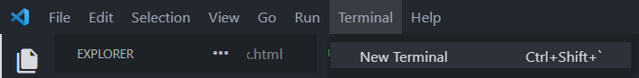
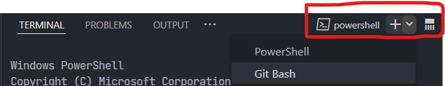

# DIV - Ashesi

## Week 1

- HTML : meaning and significance of each word

```html
<!-- information to our browser about what document type to expect -->
<!DOCTYPE html>
<!-- lang defines the natural language of our page-->
<html lang="en">
  <!-- extra info and resources our pages needs (css links, fonts, metadata etc) -->
  <head>
    <!-- make sure we can render almost all characters and symbols in the world -->
    <meta charset="UTF-8" />
    <!-- for internet explorer support -->
    <meta http-equiv="X-UA-Compatible" content="IE=edge" />
    <!-- scale to fit different screen sizes -->
    <meta name="viewport" content="width=device-width, initial-scale=1.0" />
    <!-- Title of the document, displayed in the tab view -->
    <title>DIV</title>
  </head>
  <!-- Where our website/webapp display goes -->
  <body></body>
</html>
```

### Extra Resources

[on use of lang attribute](https://adrianroselli.com/2015/01/on-use-of-lang-attribute.html)  
[lang attribute](https://www.matuzo.at/blog/lang-attribute/)  
[meta charset](https://www.w3schools.com/tags/att_meta_charset.asp)

- CSS -> meaning and significance of each word

  - internal css
  - linking to external stylesheets

- JS
  - internal javascript
  - linking to external javascript files
  - why we don't link scripts in the header

## Week 2

[flexboxfroggy](https://flexboxfroggy.com/)

## Week 3

### Git & Github

- [x] Download and install [gitbash](https://git-scm.com/downloads)

- [x] Create a new folder

- [x] Open newly created folder in vscode

- [x] Launch your terminal from the top of your editor



- [x] By default its going to be **powershell**. Chage it to **bash** by clicking on the dropdown and selecting **git bash** as shown below



### Diving into Git Commands

#### Tell git to track changes in our project folder ( we do this once for every new project)

```py
git init
```

Create a new file (.html or .py) and fill it with some content

---

#### Checking the status of our project folder

```py
git status
```

Infomation about the state of the files in the folder should be displayed. The file previously created would be displayed and colored red, implying that its been modified but yet to be moved to the **staging area**

_Staging Area is an intermediary stage for changes we plan to commit_

---

#### Adding our file to the staging area

```py
git add .
```

---

#### Checking the status of our project folder again (after adding the file to the staging area)

```py
git status
```

This time around the name of our file should be shown in green, implying that its in the staging area and ready to be committed

---

#### Time to commit

```py
git commit -m "type your commit message here"

# for example, if we added a new function to calculate sum of numbers

git commit -m "add function to calculate sum of numbers"

```
